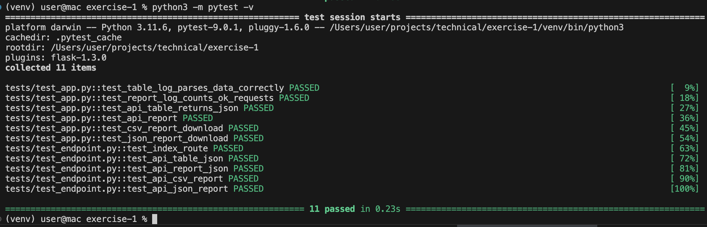
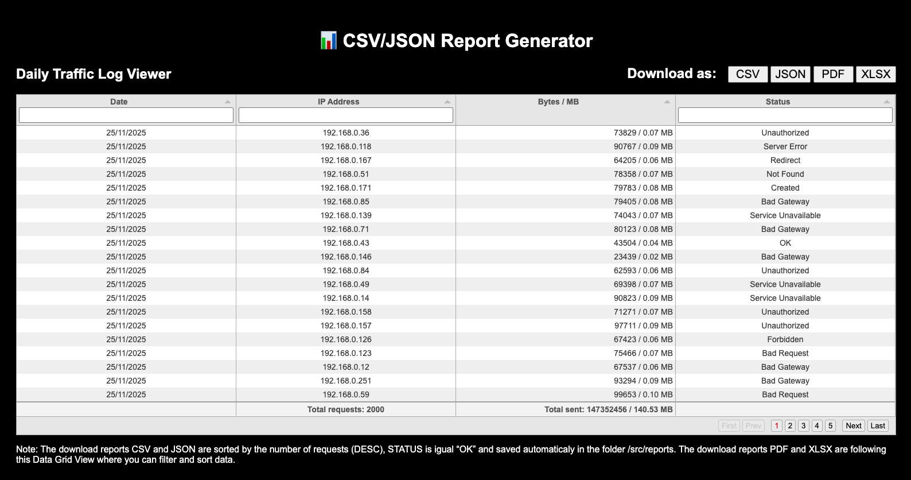
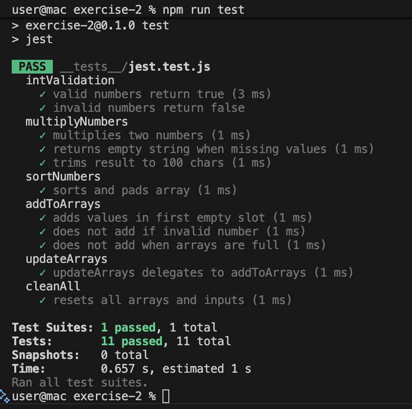
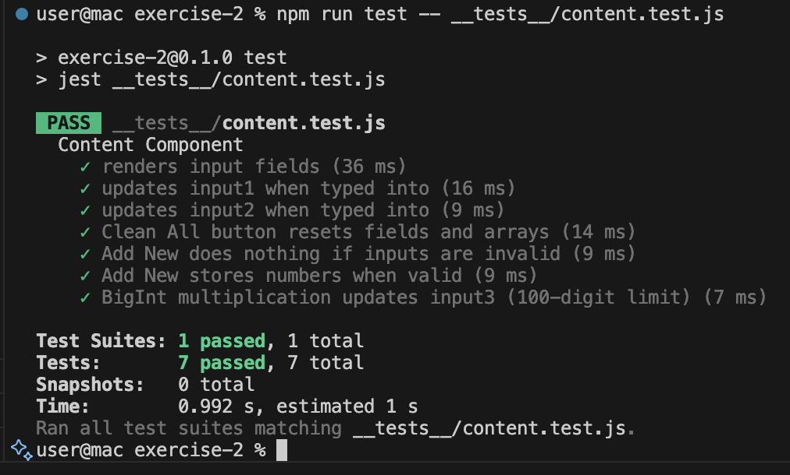
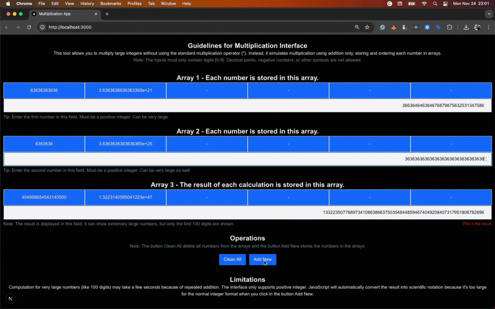

# Technical Tests

Implementing some Technical Tests

# Exercise #1
````
As software developer, you have to implement a method in order to produce the following daily report: 

/reports/ipaddr.csv 
It must be a text/csv file containing the traffic data per IP Address. Each row must include the following fields: 

IP Address 

Number of requests 

Percentage of Total Requests 

Total Bytes sent 

Percentage of the total amount of bytes 

The data set must be sorted by the number of requests (DESC).  
The source data for your report is stored in the file 

/logfiles/requests.log where each row (record) contains the following semicolon-separated values: 

TIMESTAMP: the moment when the event occurred. 

BYTES: the number of bytes sent to a client. 

STATUS: HTTP response status. 

REMOTE_ADDR: IP address of the client. 

Exclude from your report all the lines in the source file where the STATUS is different from “OK” ( RFC 2616). 

Note: 

Write the requested code in Python; 

Don’t use any frameworks but write the con in Python 3.x using only minimal libraries. 

It is not mandatory, but providing the option to choose between two possible output formats for the daily report file (e.g., CSV, JSON) will be considered. 

Although not required, including unit tests will also be taken into account. 
````

````
Steps for new projects: 

python3 -m venv venv
source venv/bin/activate
touch requirements.txt
pip3 install Flask pytest pytest-flask
pip3 freeze > requirements.txt

Steps for old projects: 

rm -rf venv
python3 -m venv venv
source venv/bin/activate
pip3 install -r requirements.txt

Create the Project Structure

````

## Description

This tool allows you to download reports in CSV, JSON, PDF, XLSX from a log file stored at /logfiles/requests.log. This file contains the traffic data per IP Address. The interface allows you to filter and sort data.

Note: The download reports CSV and JSON are sorted by the number of requests (DESC), STATUS is igual “OK” and saved automaticaly in the folder /src/reports. The download reports PDF and XLSX are following the Data Grid View where you can filter and sort data.

| Features | 
|----------|
| Load data from a log file. |
| Interface auto-resize with content. |
| Show data from endpoint request. |
| Display the result nicely formatted. |
| Save reports in the server and client side. |
| Generate reports in CSV, JSON, PDF, XLSX. |
| Filter and sort data from the interface. |
| Customized CSV and JSON report with percentage. |

## Endpoints

| APIs | 
|------|
| http://127.0.0.1:5000/api/report |
| http://127.0.0.1:5000/api/table |
| http://127.0.0.1:5000/api/csv_report |
| http://127.0.0.1:5000/api/json_report |

## Unit Tests

 

| Pytest Unit Tests | 
|-----------------|
| Parses data |
| Data returns |
| Status codes |
| Endpoints |
| CSV file generation |
| JSON file generation |

## Commands

| CMD | Description |
|-----|-------------|
| pip3 install -r requirements.txt | Install the dependencies. |
| python3 src/app.py | Run the project. | 
| python3 src/generate_log.py | Generate a sample of Log File |
| python3 -m pytest -v | Run all tests. |

## Web Interface

http://127.0.0.1:5000/



# Exercise #2 
````
You are tasked with implementing a method to multiply integer numbers using the addition operator (+) instead of the multiplication operator (x), while storing the values in arrays. For example, to calculate “15 × 2” you would store these values in two arrays to perform the operation: 
````

  

````
The result will end in a third array as in : 
````

 

````
Since the addition operation is limited to single digits [0-9], the new multiplication function must be capable of calculating the factorial of 100 (100!, the product of the first 100 integers) 

Implement the required code using a programming language of your choice. 

Unit tests are optional but will be appreciated. 
````

## Creating a Nodejs Project

````
Steps:

npx create-next-app@15 .

✔ Would you like to use TypeScript? … No
✔ Which linter would you like to use? › ESLint … Yes
✔ Would you like to use Tailwind CSS? … Yes
✔ Would you like your code inside a `src/` directory? … Yes
✔ Would you like to use App Router? (recommended) … Yes
✔ Would you like to use Turbopack? (recommended) … No
✔ Would you like to customize the import alias (`@/*` by default)? … No

Create Global React Context

npm i -D prettier eslint-config-prettier eslint-plugin-prettier

Setup prettier and lint

Install test libraries

npm i -D jest jest-environment-jsdom @testing-library/react @testing-library/jest-dom

npm i -D @testing-library/dom

npm i -D @babel/core @babel/preset-env @babel/preset-react babel-jest

npm i -D @swc/jest @swc/core


````

## Description

This tool allows you to multiply large integers without using the standard multiplication operator (*). Instead, it simulates multiplication using addition only, storing and ordering each number in arrays.

Note: The inputs must only contain digits [0-9]. Decimal points, negative numbers, or other symbols are not allowed.

| Features | 
|----------|
| Store integer up to 15–16 digits. |
| Switches to scientific notation in the array. |
| Sort numbers in the arrays. |
| Boxes to auto-resize with content. |
| Scrollable area. |
| Tailwind card style. |
| Allows wrapping the numbers. |
| Show full number. |
| Display the result nicely formatted. |
| Numbers are sorted while empty slots stay at the end. |
| Array always has 6 positions. |
| New numbers fill the first empty spot. |
| Clean all arrays and fields. |

## Utils Tests

 

| Jest Unit Tests | 
|-----------------|
| Add to array |
| Array updating |
| Integer Validation |
| Sorting Numbers |
| Multiplication |
| Clean arrays and fields |

## Content Tests

 

| Jest Unit Tests | 
|-----------------|
| Rendering |
| Input typing |
| Clean All |
| Add New |
| BigInt multiplication |

## Commands

| CMD | Description |
|-----|-------------|
| npm run install | Install the dependencies. |
| npm run build | Build the project. |
| npm run dev | Run the project. | 
| npm run start | Run the project from the built folder (.next). |
| npm run lint | Check code quality, errors, best practices. |
| npm run format | Code formatting, style consistency. |
| npm run test | Run all tests. |
| npm run test -- __tests__/content.test.js | Run tests for the components. |
| npm run test -- __tests__/utils.test.js | Run tests for functions. |

## Web Interface

http://localhost:3000

