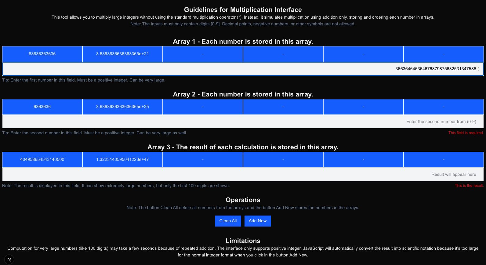

# Exercise #2

```
You are tasked with implementing a method to multiply integer numbers using the addition operator (+) instead of the multiplication operator (x), while storing the values in arrays. For example, to calculate “15 × 2” you would store these values in two arrays to perform the operation:
```


```
The result will end in a third array as in :
```


```
Since the addition operation is limited to single digits [0-9], the new multiplication function must be capable of calculating the factorial of 100 (100!, the product of the first 100 integers)

Implement the required code using a programming language of your choice.

Unit tests are optional but will be appreciated.
```

## Creating a Nodejs Project

```
Steps:

npx create-next-app@15 .

✔ Would you like to use TypeScript? … No
✔ Which linter would you like to use? › ESLint … Yes
✔ Would you like to use Tailwind CSS? … Yes
✔ Would you like your code inside a `src/` directory? … Yes
✔ Would you like to use App Router? (recommended) … Yes
✔ Would you like to use Turbopack? (recommended) … No
✔ Would you like to customize the import alias (`@/*` by default)? … No

Create Global React Context

npm i -D prettier eslint-config-prettier eslint-plugin-prettier

Setup prettier and lint

Install test libraries

npm i -D jest jest-environment-jsdom @testing-library/react @testing-library/jest-dom

npm i -D @testing-library/dom

npm i -D @babel/core @babel/preset-env @babel/preset-react babel-jest

npm i -D @swc/jest @swc/core


```

## Description

This tool allows you to multiply large integers without using the standard multiplication operator (\*). Instead, it simulates multiplication using addition only, storing and ordering each number in arrays.

Note: The inputs must only contain digits [0-9]. Decimal points, negative numbers, or other symbols are not allowed.

| Features |
| -------- |

| Store integer up to 15–16 digits.
| Switches to scientific notation in the array.
| Sort numbers in the arrays.
| Boxes to auto-resize with content.
| Scrollable area.
| Tailwind card style.
| Allows wrapping the numbers.
| Show full number.
| Display the result nicely formatted.
| Numbers are sorted while empty slots stay at the end.
| Array always has 6 positions.
| New numbers fill the first empty spot.
| Clean all arrays and fields.

## Utils Tests


| Jest Unit Tests |
| --------------- |

| Add to array
| Array updating
| Integer Validation
| Sorting Numbers
| Multiplication
| Clean arrays and fields

## Content Tests


| Jest Unit Tests |
| --------------- |

| Rendering
| Input typing
| Clean All
| Add New
| BigInt multiplication

## Commands

| CMD                                       | Description                                   |
| ----------------------------------------- | --------------------------------------------- |
| npm run build                             | Build the project                             |
| npm run dev                               | Run the project                               |
| npm run start                             | Run the project from the built folder (.next) |
| npm run lint                              | Check code quality, errors, best practices.   |
| npm run format                            | Code formatting, style consistency.           |
| npm run test                              | Run all tests.                                |
| npm run test -- **tests**/content.test.js | Run tests for the components.                 |
| npm run test -- **tests**/utils.test.js   | Run tests for functions.                      |

## Web Interface

http://localhost:3000


